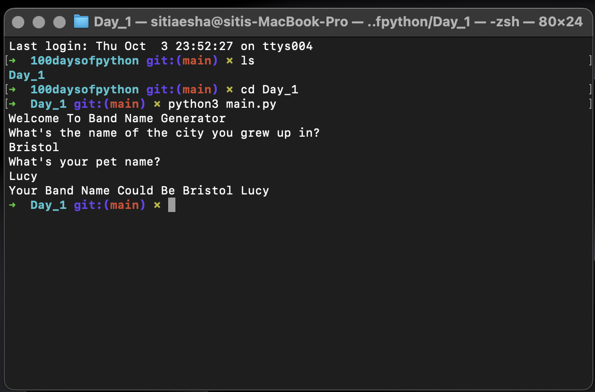
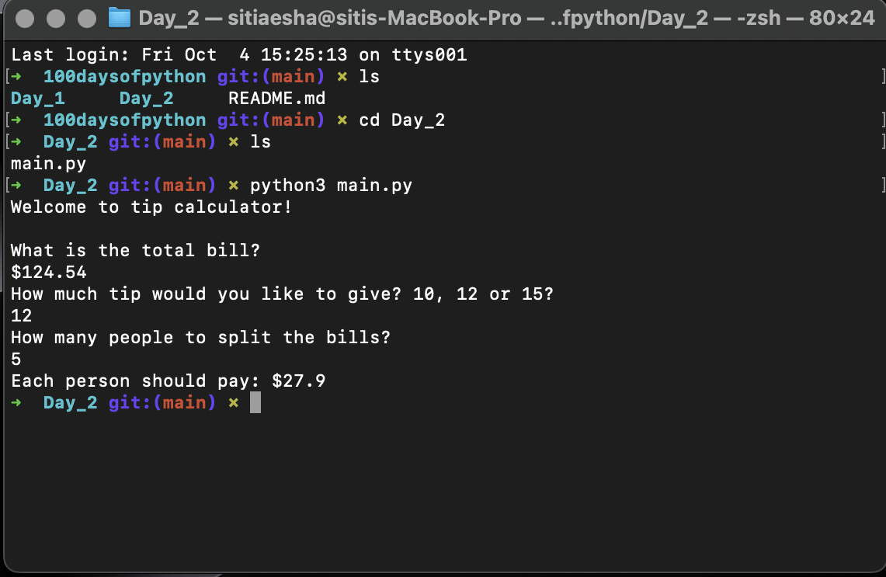

# Documentation & Record

This is where i keep all the neccesarry documentation, records, notes, summary and source code throughout this journey #100days
## Day 1

Program : Band Name Generator 

filename : [main.py](Day_1/main.py)

### Summary/notes

working with variables and inputs to manage data, just simple stuff to warm up

### Output/Outcome

## Day 2

Program : Tip Calculator

filename : [main.py](Day_2/main.py)

### Summary/notes

working with data types and manipulating strings (still some simple challenge) 

relax, it's only day 2.

### Output/Outcome

