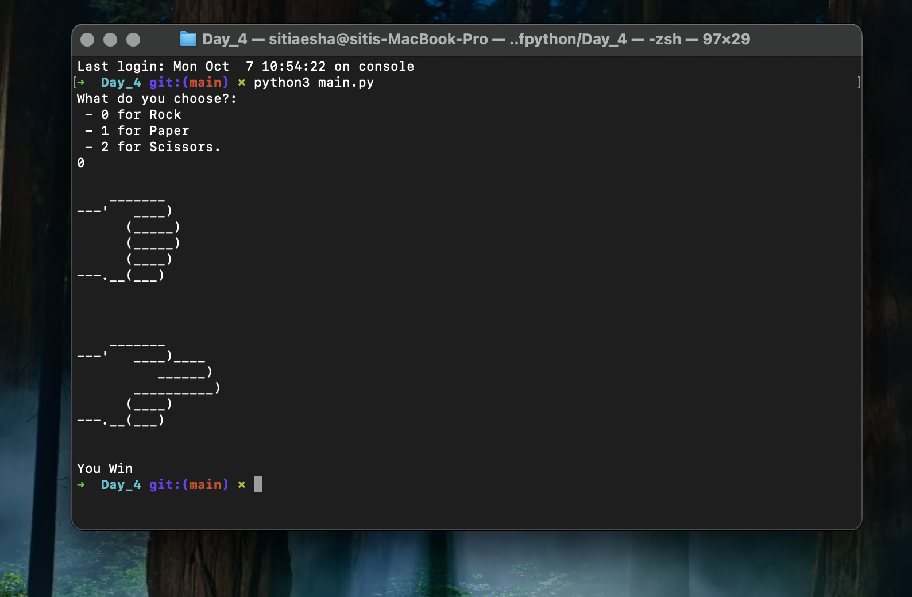
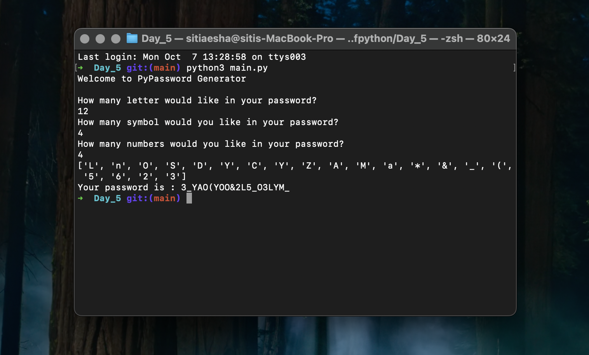
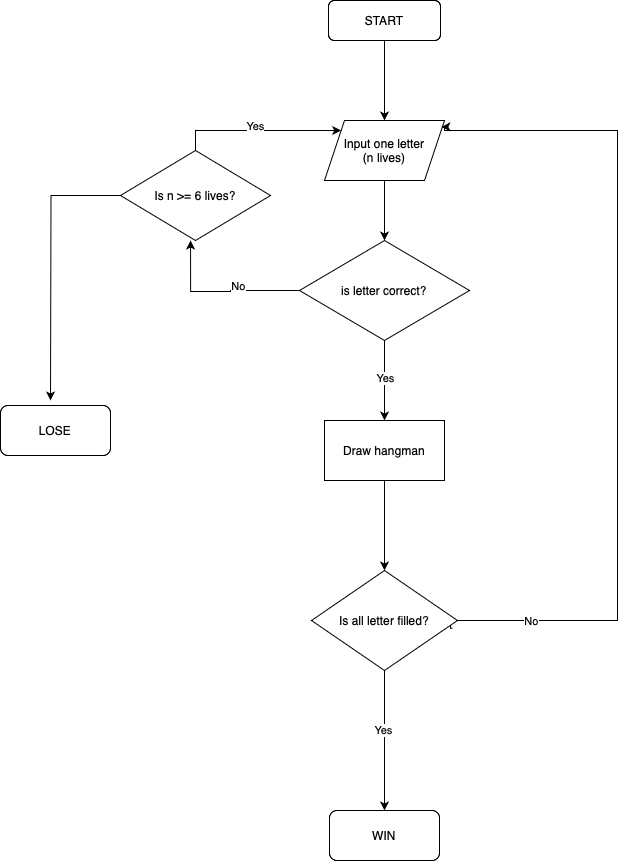
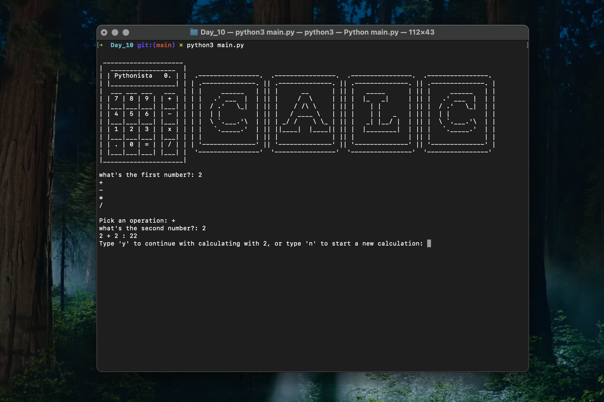

# Documentation & Record

This is where i keep all the neccesarry documentation, records, notes, summary and source code throughout this journey #100days
## Day 1

Program : Band Name Generator 

filename : [main.py](Day_1/main.py)

### Summary/notes

working with variables and inputs to manage data, just simple stuff to warm up

### Output/Outcome

## Day 2

Program : Tip Calculator

filename : [main.py](Day_2/main.py)

### Summary/notes

working with data types and manipulating strings (still some simple challenge) 

relax, it's only day 2.

### Output/Outcome

## Day 3

Program : The Threshing (Or should I say..an awesome choose your own adventure game!)

filename : [main.py](Day_3/main.py)

### Summary/notes

Alright! let's kick it up a notch by adding conditional statement, control flow, logical operator and some combination of things to build a simple choose your own adventure game. 

### Program Planning/Flowchart

Okay, so my idea for this adventure game is basically dragon adventure story. I'm kinda obsessed with Fourth Wing (fantasy book im reading now) and i just want to play around with that idea for a bit. simple stuff since i only have a day. 

### Output/Outcome

## Day 4

Program : Rock, Paper Scissors Game

filename : [main.py](Day_4/main.py)

### Summary/notes

Okay, so let's be random and play with randomisation and list!

### Output/Outcome

## Day 5

Program : PyPassword Generator

filename : [main.py](Day_5/main.py)

### Summary/notes

Okay, so let's be random and play with randomisation, list...and loops!

### Output/Outcome

## Day 6 - 7

Program : The Hangman Game

filename : [main.py](Day_6_7/main.py)

### Summary/notes

Okay, so let's kick it up a notch and get a bit dirty! 
This project will span around two days. 

### Flowchart Program

### Output/Outcome

## Day 8

Program : Caeser Cipher Program

filename : [main.py](Day_8/main.py)

### Summary/notes

-

### Output/Outcome

## Day 9

Program : Secret Auction Program

filename : [main.py](Day_9/main.py)

### Summary/notes

Using dictionaries and nesting to build a secret auction program.

### Output/Outcome

## Day 10

Program : Calculator Program

filename : [main.py](Day_10/main.py)

### Summary/notes

- Build a simple calculator program with basic arimethic operation

### Output/Outcome

## Day 11

Program : Blackjack Program

filename : [main.py](Day_11/main.py)

### Summary/notes

The blackjack capstone project

### Output/Outcome
